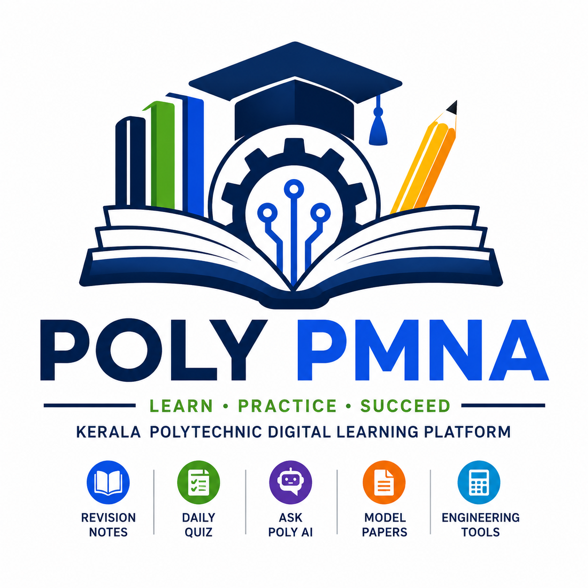

# POLY PMNA

<p align="center">
  
</p>

<h1 align="center">POLY PMNA</h1>

<p align="center">
<b>Kerala Polytechnic Digital Learning Platform</b>
</p>

<p align="center">
Revision 2026 &middot; Revision 2021 &middot; Revision 2015 &middot; Ask Poly AI &middot; Daily Quiz &middot; Engineering Tools
</p>

---

## Official Website

**Website:** [https://polypmna.dpdns.org/](https://polypmna.dpdns.org/)

**Documentation:** [https://github.com/nandurpm/diploma-notes/wiki](https://github.com/nandurpm/diploma-notes/wiki)

---

## About POLY PMNA

POLY PMNA is a comprehensive digital learning platform developed to support **Kerala Polytechnic students** throughout their academic journey. The platform provides syllabus-based study materials, structured lesson notes, AI-powered learning assistance, daily quizzes, engineering tools, model question papers, and other educational resources through a modern, responsive web application.

Its primary objective is to make quality learning resources accessible from a single platform while continuously improving the learning experience with new technologies and digital tools.

---

## Key Features

### Academic Resources

| Feature | Description |
|---------|-------------|
| Revision 2026 Portal | Full syllabus coverage with lesson pages, notes, and department browsers |
| Revision 2021 Portal | Legacy syllabus with lesson pages and downloadable notes |
| Revision 2015 Archive | Historical materials from the 2015 syllabus |
| Lesson Notes | Detailed HTML lesson pages with continuous reading mode |
| Formula Banks | Quick-reference formula collections per subject |
| Model Question Papers | SITTTR Kerala official model papers (linked externally) |
| Subject-wise Materials | Organised by department, semester, and course code |

### Smart Learning

| Feature | Description |
|---------|-------------|
| Ask Poly AI | AI-powered chat assistant for syllabus queries and study help |
| Smart Content Search | Context-aware search across lesson content and subject databases |
| Offline Knowledge | Local knowledge base for assistant responses |

### Student Practice

| Feature | Description |
|---------|-------------|
| Daily Quiz | Subject-based daily quizzes with authentication and leaderboards |
| Mock Examinations | Full exam simulation (currently Course 1004: Engineering Mechanics) |
| Score Analysis | Instant scoring with rubric-based and AI-assisted evaluation |

### Engineering Utilities

| Feature | Description |
|---------|-------------|
| Engineering Calculators | Course-specific calculation tools |
| Unit Converters | Engineering unit conversion utilities |
| Reference Tables | Formulas, constants, and conversion factors |

### Platform

| Feature | Description |
|---------|-------------|
| Responsive Design | Works on desktop, tablet, and mobile |
| Progressive Web App | Installable on mobile devices |
| Cloud Hosting | Cloudflare Pages with Workers for server-side logic |
| Android App | Native Android wrapper available in `android-app/` |

---

## Repository Structure

```
diploma-notes/
├── assets/                      # Static assets (JS, CSS, data, media)
│   ├── css/                     # Stylesheets
│   ├── data/                    # JSON data files
│   ├── icons/                   # UI icons
│   ├── images/                  # Root-level images
│   ├── js/                      # JavaScript modules
│   ├── lesson-content/          # Shared lesson content fragments
│   ├── media/                   # Images, logos, department artwork
│   ├── popup/                   # Visitor popup media
│   └── vendor/                  # Third-party libraries
├── lessons/                     # Revision 2021 lesson HTML pages
├── notes/                       # Revision 2021 downloadable PDF notes
├── revision-2021/               # Revision 2021 department pages
├── revision-2026/               # Revision 2026 department pages
├── revision-2026-content/       # Revision 2026 lessons and notes
│   ├── lessons/                 # Revision 2026 lesson HTML pages
│   └── notes/                   # Revision 2026 downloadable PDF notes
├── tools/                       # Engineering tools pages
├── maintenance/                 # Maintenance page
├── functions/                   # Cloudflare Pages Functions (middleware)
├── workers/                     # Cloudflare Workers (Ask POLY AI)
├── supabase/                    # Supabase backend (auth, quiz, DB)
│   ├── functions/               # Supabase Edge Functions
│   └── migrations/              # Database migration files
├── docs/                        # Internal documentation
├── downloads/                   # Standalone downloadable resources
├── reports/                     # Generated analytics reports
├── notifications/               # Notification configuration
├── images/                      # Legacy images and guide screenshots
├── android-app/                 # Android app source
├── automation/                  # Automated scripts
├── data/                        # Root-level data files
├── .github/workflows/           # GitHub Actions CI/CD
├── .jules/                      # Jules automation agent config
└── .well-known/                 # Standard web well-known files
```

---

## Technology Stack

| Layer | Technology |
|-------|------------|
| Frontend | HTML5, CSS3, JavaScript (ES6+) |
| Hosting | GitHub Pages + Cloudflare Pages |
| Server-side | Cloudflare Workers, Cloudflare Pages Functions |
| Backend | Supabase (PostgreSQL, Auth, Edge Functions) |
| CI/CD | GitHub Actions |
| AI | OpenAI API (via Cloudflare Worker) |
| Mobile | Expo / React Native (Android app) |

---

## Getting Started

### For Students

Visit [https://polypmna.dpdns.org/](https://polypmna.dpdns.org/) and navigate using the top menu. Select your revision year, choose your department, and access lessons, notes, tools, or AI assistance.

### For Contributors

1. Fork this repository
2. Read the documentation in `docs/` for architecture details
3. Each directory has a `README.md` explaining its purpose
4. Test changes locally before submitting a pull request

### Adding a New Lesson (Revision 2026)

1. Create a new HTML file in `revision-2026-content/lessons/` named `lessons-[COURSE_CODE].html`
2. The GitHub Actions workflow will detect the new file and activate the "View Lessons" button on the matching subject card
3. Optionally add a notes PDF in `revision-2026-content/notes/` named `downloadable-notes-[COURSE_CODE].pdf`

See `revision-2026-content/README.md` for full instructions.

---

## Documentation

Each directory contains a `README.md` file with detailed documentation:

| Directory | Documentation |
|-----------|--------------|
| `assets/js/` | JavaScript module index and loading order |
| `assets/css/` | Stylesheet organisation and scope |
| `assets/data/` | JSON data file descriptions |
| `assets/media/` | Media asset organisation |
| `supabase/` | Database schema and edge functions |
| `functions/` | Cloudflare Pages middleware |
| `workers/` | Cloudflare Worker deployment |
| `tools/` | Developer automation, site validation, and maintenance scripts (`README-maintenance.md`) |
| `docs/` | Internal architecture documentation |

---

## Project Roadmap

Future development includes:

- Android Application Enhancements
- AI Knowledge Base Expansion
- Student Dashboard and Progress Tracking
- Leaderboards and Performance Analytics
- Offline Learning Support
- Voice-Based Learning
- Additional Mock Exam Courses
- Expanded Engineering Tools

---

## Contributing

Suggestions and bug reports are always welcome. If you discover an issue or have an idea for improvement, please create a [GitHub Issue](https://github.com/nandurpm/diploma-notes/issues).

Please read the project documentation before submitting pull requests or feature requests.

---

## Security

If you discover a security vulnerability, please read **SECURITY.md** before reporting it. Please avoid disclosing security issues publicly until they have been reviewed.

---

## License and Copyright

This project is protected under a **Custom Copyright Notice &mdash; All Rights Reserved**.

Unless explicit written permission is granted by the copyright holder, you may **not** copy, reproduce, redistribute, host, or publish this project or any substantially similar version.

Please refer to the **LICENSE** file for complete terms and conditions.

---

## Developer

**Nandakumar M**

Electrical & Electronics Design Engineer

Johnson Lifts & Escalators

Kerala, India

---

## Official Links

| Resource | URL |
|----------|-----|
| Website | [https://polypmna.dpdns.org/](https://polypmna.dpdns.org/) |
| GitHub | [https://github.com/nandurpm/diploma-notes](https://github.com/nandurpm/diploma-notes) |
| Documentation | [https://github.com/nandurpm/diploma-notes/wiki](https://github.com/nandurpm/diploma-notes/wiki) |

---

<p align="center">
Made with care for Kerala Polytechnic Students
</p>
